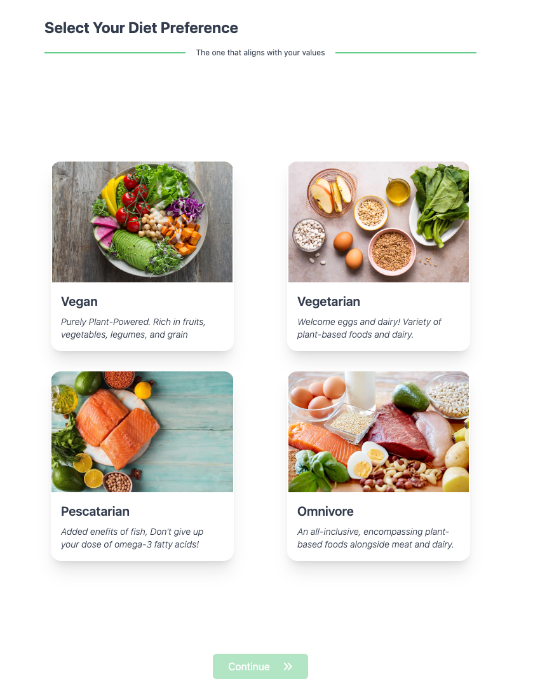

# SmartTaste

SmartTaste is an innovative app developed during [HackaTUM](https://hack.tum.de/), aiming to revolutionize the meal recommendation experience for Hello Fresh users. By leveraging a hybrid recommendation system, SmartTaste offers personalized meal suggestions based on user preferences, learned dynamically through user interactions.

## Technologies Used

- **Frontend**: React
- **Backend**: FastAPI
- **Recommendation System**: A hybrid approach combining content-based and collaborative filtering
- **Accessibility Features**: Speech-to-text and Text-to-Speech integrations, OpenAI Assistant API
<!-- - **Other Technologies**: [List any other technologies, libraries, or frameworks used]-->

## Project Stack

- **Frontend**: React.js for a responsive and interactive user interface
- **Backend**: FastAPI for efficient and scalable server-side operations
- **Database**: SQL Alchemy for ORM + SQLite for dev environment
- **APIs**: OpenAI Assistant API for enhanced user interaction and accessibility
<!-- - **Deployment**: [Specify if you used any cloud services or deployment tools]-->

## Features

1. **Hybrid Recommender System**: Combines user preferences and collaborative data to suggest the perfect meals.
2. **Gamified User Onboarding**: Simplifies the initial interaction while collecting valuable data for the recommendation algorithm.
3. **Accessibility Support**: Ensures an inclusive experience for users with visual impairments through advanced speech technologies.
<!-- 4. **[Other Features]**: [Describe any other significant features of the app] -->

## Screenshots and GIFs

Below are some glimpses of SmartTaste in action:

## Getting Started

_TODO_
<!--[Include instructions on how to set up the project locally, any prerequisites, and steps to get it running.]-->

## Contributions

This project was made possible by the dedicated efforts of Level11 and Fabio. Special thanks to HackaTUM and Hello Fresh for providing the challenge and support.

## Additional Information

For more details about the hackathon and our project, check out our submission on DevPost: https://devpost.com/software/level11
